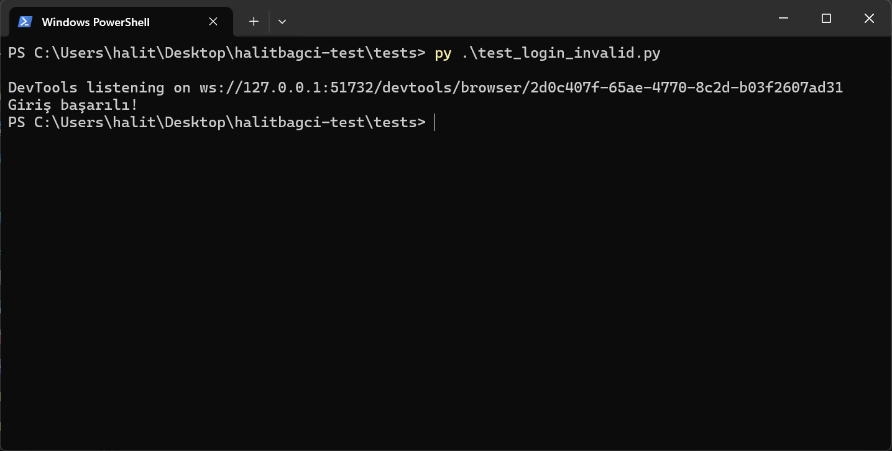

# 🔐 Test Otomasyon Ödevi – Geçersiz Giriş Testi

Bu proje, Marmara Üniversitesi'nin **Yazılım Mühendisliği** dersi kapsamında verilen uygulamalı ödev için hazırlanmıştır. Amaç, basit bir login sayfasında, geçersiz kullanıcı bilgileriyle yapılan girişin doğru şekilde reddedildiğini test etmektir.

## 🎯 Uygulama Senaryosu

1. Tarayıcı başlatılır.
2. Login sayfasına gidilir: [https://the-internet.herokuapp.com/login](https://the-internet.herokuapp.com/login)
3. Yanlış kullanıcı adı ve/veya şifre girilir.
4. "Invalid credentials" (veya eşdeğer hata) mesajının görünüp görünmediği kontrol edilir.
5. Test çalıştırılır ve sonuç gözlemlenir.

## 🧰 Kullanılan Teknolojiler

- **Python 3.13.3**
- **Selenium WebDriver**
- Web tarayıcısı: Google Chrome

## 📝 Açıklama

Test scripti, Selenium kütüphanesi kullanılarak yazılmıştır. Kod, login ekranına hatalı bilgi gönderip gelen uyarı mesajını kontrol eder. Sonuç, başarıyla çalıştırıldığında test-sonucu.png dosyasında görülebilir.

## 📸 Ekran Görüntüsü

Aşağıda, testin sonucunu gösteren ekran görüntüsü yer almaktadır:

## 📁 Dizin Yapısı
halitbagci-test/
├── tests/
│ └── test_login_invalid.py
├── README.md
└── test-sonucu.png

